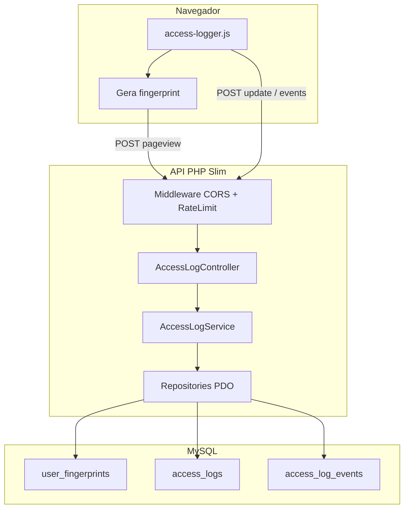
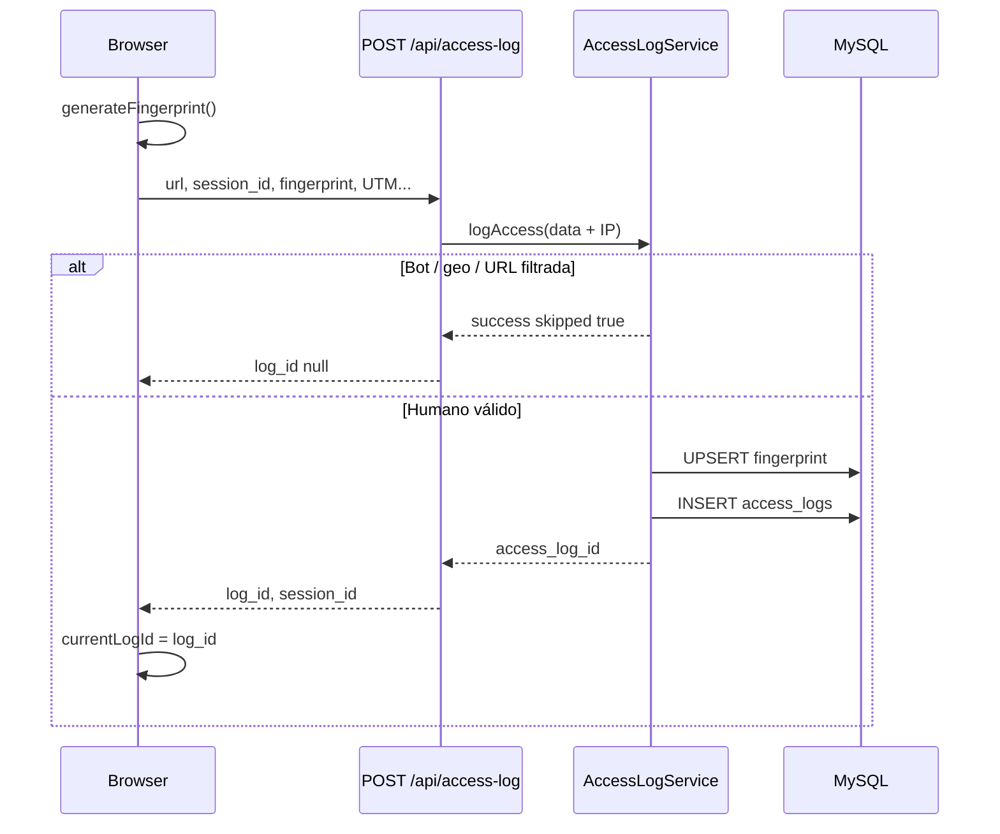

# Arquitetura — Access Logger

Microserviço de **telemetria web**: identifica dispositivos (fingerprint), registra pageviews e eventos de interação. Pensado para rodar standalone (Slim 4 + PDO + MySQL) e ser consumido por qualquer site via JavaScript.

**Fora do escopo deste projeto:** auditoria de feature gates (`access_log_feature_events`, `auth-gate.js`). Isso permanece no produto Meelion.

---

## Visão geral

### Responsabilidades por camada

| Camada | Responsabilidade |
|--------|------------------|
| **Cliente (`access-logger.js`)** | Fingerprint, `session_id`, pageview inicial, scroll/tempo, fila de eventos, flush com `sendBeacon` na saída |
| **API** | Validar JSON, enriquecer IP/referer, orquestrar service, JSON de resposta |
| **Service** | Regras de negócio: bot filter, geo filter, UTM, ordem de navegação, normalização de eventos |
| **Repository (PDO)** | SQL explícito — sem ORM |
| **MySQL** | Persistência e índices para jornada e relatórios |

---

## Modelo de dados

Três tabelas core (ver [DATABASE.md](./DATABASE.md) e [sql/schema_core.sql](./sql/schema_core.sql)):

1. **`user_fingerprints`** — visitante/dispositivo estável entre sessões (`fingerprint_hash` único).
2. **`access_logs`** — uma linha por carregamento de página na sessão.
3. **`access_log_events`** — N eventos por pageview (cliques, milestones, etc.).

Relações:

- `access_logs.user_fingerprint_id` → `user_fingerprints.id` (CASCADE)
- `access_logs.previous_access_log_id` → `access_logs.id` (SET NULL) — cadeia de navegação na mesma `session_id`
- `access_log_events.access_log_id` → `access_logs.id` (CASCADE)

Coluna opcional **`access_logs.user_id`** — quando o host app autentica o visitante, pode vincular histórico anônimo ao usuário logado (adapter documentado em [EXTRACTION-MEELION-INTEGRATION.md](./EXTRACTION-MEELION-INTEGRATION.md)).

---

## Fluxo: pageview inicial

**Ordem de navegação:** para cada `session_id`, o service incrementa `navigation_order` e preenche `previous_access_log_id` com o último log da mesma sessão.

**UTM:** extraídos da query string da `url` no servidor (`utm_source`, `utm_medium`, `utm_campaign`, `utm_term`, `utm_content`).

---

## Fluxo: vida da página

| Momento | Cliente | Servidor |
|---------|---------|----------|
| Scroll / timer (30s) | Atualiza `maxScrollDepth`, pode chamar update | `POST /api/access-log/update` — campos `scroll_depth`, `time_on_page`, `exit_type` |
| Clique `data-ga4-event` | `enqueueEvent()` → buffer | — |
| Flush (5s ou 20 eventos) | `POST /api/access-log/events` (batch ≤100) | `recordEvents()` |
| `pagehide` | `sendBeacon` + update com `exit_type` | Persistência final |

---

## Fluxo: consultas (relatórios / debug)

| Endpoint | Uso |
|----------|-----|
| `GET /api/access-log/stats` | Totais filtrados por data e autenticação |
| `GET /api/access-log/journey?session_id=` | Pageviews ordenados por `navigation_order` |
| `GET /api/access-log/fingerprint` | Detalhe por `fingerprint_id` ou `fingerprint_hash` |

Na fase 4 (ROADMAP), um dashboard consumirá esses endpoints e SQL agregado adicional.

---

## Filtros e qualidade de dados

Aplicados em `logAccess()` **antes** de gravar (detalhes em [BOT-FILTERING.md](./BOT-FILTERING.md)):

1. **URL blocklist** — hosts de staging/dev configuráveis.
2. **Bot User-Agent** — lista de padrões + heurísticas (Chrome antigo, iOS spoofed).
3. **Bot timezone** — fusos associados a datacenters/bot farms.
4. **Geo Brasil (opcional)** — não persiste fingerprint novo fora do público-alvo; configurável no OSS.

Quando filtrado, a API responde `success: true` com `skipped: true` para não quebrar o script no browser.

---

## Rate limiting

No Meelion: [`rate_limit_access_log.php`](https://github.com/meelion/meelion) antes do bootstrap (APCu, só `POST/GET` em `/api/access-log`).

No OSS: **middleware Slim** aplicado a todo o prefixo `/api/access-log/*`:

- 20 req/min por IP
- 40 req/min por User-Agent
- Resposta `429` com `Retry-After: 60`

Implementação pode usar APCu, Redis ou arquivo em `tmp/` se APCu não estiver disponível.

---

## Autenticação

Endpoints de ingestão (**log, update, events**) são **públicos** por design (visitantes anônimos).

- Se o host enviar cookie/session de login, o controller pode preencher `user_id` e `is_authenticated`.
- Endpoints de **stats/journey** na fase 4 devem exigir **API key** ou sessão admin.

---

## O que não está neste repositório

| Componente Meelion | Motivo |
|--------------------|--------|
| `access_log_feature_events` | Auditoria de gates — específico Meelion |
| `auth-gate.js` | Modal login/Pro + registry |
| `POST /api/access-log/pixel` | Grava em `user_activities` (campanhas) |
| `ExternalLinkClicksBackupService` | Adapter opcional (SQLite backup de cliques corretora) |
| `AnalyticsService` admin | Relatórios de negócio Meelion — reimplementar no OSS fase 4 |

---

## Referência de origem

Lógica portada do monólito Meelion:

- `src/Service/AccessLogService.php`
- `src/Controller/AccessLogController.php`
- `webroot/js/access-logger.js`

Ver [EXTRACTION-INVENTORY.md](./EXTRACTION-INVENTORY.md) para mapeamento ficheiro a ficheiro.
