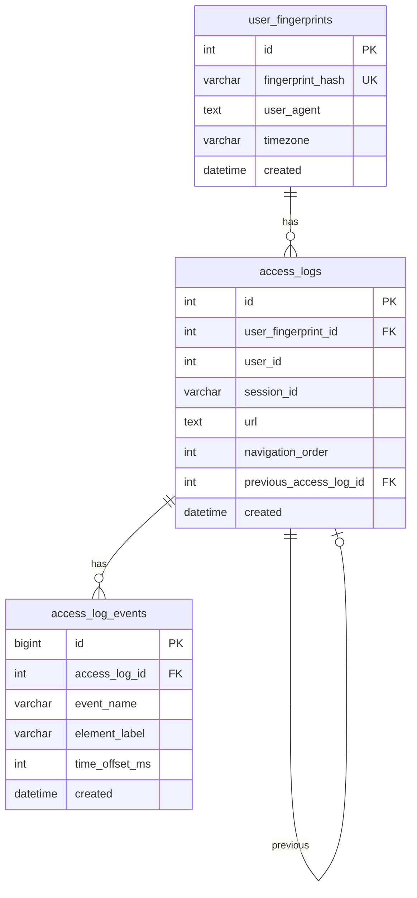

# Modelo de dados

Fonte de verdade para instalação: [`sql/schema_core.sql`](./sql/schema_core.sql).

---

## Diagrama ER



---

## Tabela `user_fingerprints`

Identifica um **dispositivo/navegador** de forma estável entre visitas.

| Coluna | Tipo | Notas |
|--------|------|-------|
| `id` | INT PK AI | |
| `fingerprint_hash` | VARCHAR(64) UNIQUE | SHA-256 de sinais estáveis (ver service) |
| `screen_resolution` | VARCHAR(20) | ex. `1920x1080` |
| `user_agent` | TEXT | |
| `ip_address` | VARCHAR(45) | Atualizado no último acesso |
| `operating_system` | VARCHAR(100) | Detectado no cliente ou servidor |
| `browser_name` / `browser_version` | VARCHAR | |
| `device_type` | ENUM | `desktop`, `mobile`, `tablet`, `unknown` |
| `language` | VARCHAR(10) | ex. `pt-BR` |
| `timezone` | VARCHAR(50) | IANA |
| `color_depth`, `pixel_ratio`, `touch_support` | | Sinais de hardware |
| `webgl_vendor`, `webgl_renderer` | VARCHAR | |
| `canvas_fingerprint`, `audio_fingerprint` | VARCHAR(64) | Audio geralmente `null` no cliente atual |
| `plugins_list`, `fonts_list` | TEXT | JSON serializado |
| `created`, `modified` | DATETIME | |

**Índices:** `fingerprint_hash` (unique), `ip_address`, `device_type`, `created`.

---

## Tabela `access_logs`

Um registro por **pageview** (carregamento de URL na sessão).

| Coluna | Tipo | Notas |
|--------|------|-------|
| `id` | INT PK AI | Retornado ao cliente como `log_id` |
| `user_fingerprint_id` | INT FK | CASCADE delete |
| `user_id` | INT NULL | Opcional — host app após login |
| `session_id` | VARCHAR(128) | UUID por aba/sessão de navegação |
| `url` | TEXT | URL completa com query string |
| `referer` | TEXT | |
| `is_authenticated` | TINYINT(1) | 0 visitante, 1 logado |
| `page_load_time` | INT | ms |
| `scroll_depth` | INT | px máximo |
| `time_on_page` | INT | segundos |
| `utm_source` … `utm_content` | VARCHAR(255) | Extraídos da URL |
| `navigation_order` | INT | 1, 2, 3… na mesma `session_id` |
| `previous_access_log_id` | INT FK self | Pageview anterior na sessão |
| `exit_type` | ENUM | Como o usuário saiu da página |
| `viewport_width`, `viewport_height` | INT | |
| `created` | DATETIME | |

**Índices importantes:**

- `(session_id, navigation_order)` — jornada
- `(user_fingerprint_id, created)` — histórico por visitante
- `(is_authenticated, created)` — relatórios

---

## Tabela `access_log_events`

Eventos discretos durante um pageview.

| Coluna | Tipo | Notas |
|--------|------|-------|
| `id` | BIGINT UNSIGNED PK AI | |
| `access_log_id` | INT FK | CASCADE |
| `event_name` | VARCHAR(96) | ex. `button_click`, `scroll_depth` |
| `element_type` | VARCHAR(32) | `link`, `button`, `custom` |
| `element_label` | VARCHAR(128) | ex. valor de `data-ga4-event` |
| `target_href` | VARCHAR(255) | |
| `numeric_value` | DECIMAL(12,4) | |
| `scroll_percent` | TINYINT | 0–100 |
| `time_offset_ms` | INT UNSIGNED | ms desde início do pageview |
| `created` | DATETIME | |

**Índices:** `(access_log_id)`, `(event_name, created)`.

---

## Convenções de sessão

- `session_id` é gerado no cliente (`localStorage`) e reutilizado entre pageviews na mesma aba.
- `navigation_order` incrementa a cada novo `access_logs` com o mesmo `session_id`.
- `previous_access_log_id` aponta para o registro imediatamente anterior na sessão (árvore linear).

---

## Instalação

```bash
mysql -u root -p access_logger < docs/sql/schema_core.sql
```

Criar database antes:

```sql
CREATE DATABASE access_logger CHARACTER SET utf8mb4 COLLATE utf8mb4_unicode_ci;
```

---

## Manutenção e volume

Sugestões para produção (fase 4+):

| Tarefa | Sugestão |
|--------|----------|
| Particionamento | Por mês em `access_logs.created` se > 10M linhas |
| Retenção | Purge logs > 13 meses (LGPD — ver [PRIVACY-LGPD.md](./PRIVACY-LGPD.md)) |
| Arquivamento | Export parquet/CSV de agregados antes do purge |
| `access_log_events` | Maior volume — considerar TTL mais curto que pageviews |

---

## Diferenças em relação ao dump Meelion

| Item | Meelion produção | OSS `schema_core.sql` |
|------|------------------|------------------------|
| `access_logs.user_id` | Pode existir ou não | Incluída explicitamente |
| `access_log_events` | `access_log_id` BIGINT em migration | FK para `access_logs.id` INT |
| `access_log_feature_events` | Existe | **Não incluída** |

Ao portar dados do Meelion, migrar apenas as três tabelas core.
