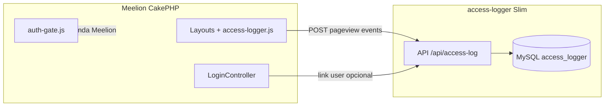

# Integração com o Meelion (sem alterar o monólito agora)

Como o site Meelion **usa hoje** o Access Logger e como passaria a consumir o microserviço `access-logger` na fase 5 (opcional).

---

## Estado atual no Meelion

### Carregamento do script

Layouts principais injetam o cliente:

- `templates/layout/newds/meelion_site.php`
- `templates/layout/site.php`
- `templates/layout/links.php` (só o JS)

Padrão:

```javascript
window.accessLogger = new AccessLogger({
  endpoint: '<?= $this->Url->build('/api/access-log', ['fullBase' => true]) ?>',
  updateEndpoint: '.../api/access-log/update',
  eventsEndpoint: '.../api/access-log/events'
});
```

### API no mesmo host

Rotas Cake em `config/routes.php` → `AccessLogController` no container `meelion-apache`.

Rate limit: `webroot/rate_limit_access_log.php` carregado em `webroot/index.php` **antes** do Cake (só path exato `/api/access-log`).

### Após login

`LoginController` chama:

```php
$accessLogService->linkAccessLogsToUserByFingerprint($fingerprintId, $userId);
```

Preenche `access_logs.user_id` e `is_authenticated` para logs anônimos do mesmo dispositivo.

### O que **não** é Access Logger core

| Feature | Ficheiros |
|---------|-----------|
| Gates / modais Pro | `auth-gate.js`, `access_log_feature_events` |
| Pixel campanhas | `POST /api/access-log/pixel` → `user_activities` |
| Checkout attribution | `CheckoutController`, `SubscriptionService` + ALFE |
| Admin analytics | `AnalyticsService`, `System/AnalyticsController` |

Estes **permanecem no Meelion** mesmo após migrar telemetria.

---

## Migração futura (fase 5) — só telemetria

### 1. Deploy do microserviço

- URL ex.: `https://logger.meelion.com` ou subpath interno Docker
- CORS: permitir `https://www.meelion.com` e `http://meelion.localhost`
- Importar schema: `docs/sql/schema_core.sql` em DB dedicado `access_logger`

### 2. Alteração mínima nos layouts Meelion

Trocar apenas URLs do construtor:

```javascript
window.accessLogger = new AccessLogger({
  endpoint: 'https://logger.meelion.com/api/access-log',
  updateEndpoint: 'https://logger.meelion.com/api/access-log/update',
  eventsEndpoint: 'https://logger.meelion.com/api/access-log/events'
});
```

**Manter** `access-logger.js` servido do Meelion **ou** apontar script para CDN do repo OSS.

### 3. Login — vínculo user_id

Opção A — **webhook interno** (recomendado):

Meelion após login POST server-to-server:

```
POST https://logger.meelion.com/internal/link-user
Authorization: Bearer <MEELION_SERVICE_TOKEN>
{ "fingerprint_hash": "...", "user_id": 123 }
```

Opção B — manter endpoint no Meelion que proxy para o logger.

Opção C — próximo pageview já autenticado envia `user_id` (Cake identity) — não retroage 100% do histórico.

### 4. Gates continuam no Meelion

`auth-gate.js` ainda precisa de `window.accessLogger.currentLogId` apontando para o **mesmo** backend que grava pageviews:

- Se logger externo: gates devem usar API Meelion proxy **ou** migrar gate audit depois (fora do escopo OSS).

**Cenário simples fase 5:** microserviço só pageviews/eventos; gates continuam POSTando no Cake Meelion até decisão futura.

### 5. Desligar código duplicado no Meelion

Somente após validação em paralelo:

1. Remover rotas `/api/access-log` do `routes.php` (exceto proxy se necessário)
2. Remover `AccessLogController` / `AccessLogService` do monólito **ou** deixar thin proxy
3. Manter `auth-gate` e pixel intactos

---

## Diagrama alvo (fase 5)



---

## Variáveis de ambiente sugeridas (Meelion)

Sem usar `.env` no fluxo Meelion local — preferir `config/app_local.php`:

```php
'AccessLogger' => [
    'base_url' => 'https://logger.meelion.com',
    'enabled' => true,
],
```

Layouts leem `Configure::read('AccessLogger.base_url')` para montar endpoints do JS.

---

## Checklist de validação antes do cutover

- [ ] Pageviews aparecem no DB `access_logger`
- [ ] `currentLogId` definido em páginas reais (não skipped em massa)
- [ ] Eventos `data-ga4-event` gravados
- [ ] Rate limit não bloqueia tráfego legítimo
- [ ] CORS sem erros no console
- [ ] Login vincula `user_id` (se implementado)
- [ ] Dashboards admin Meelion ainda funcionam **ou** migrados para logger fase 4
- [ ] Gates/modais sem regressão

---

## Dual-write (opcional, transição)

Por 1–2 semanas, POST duplicado Meelion + microserviço para comparar contagens. Desligar Meelion quando diferença &lt; threshold acordado.

Não implementar na fase 1–4 deste repositório.
