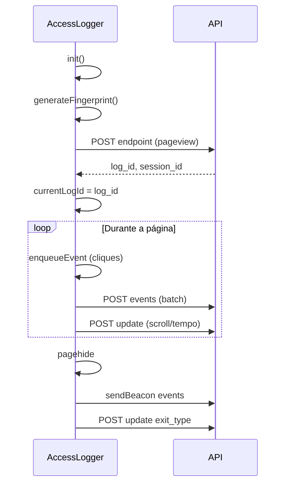

# Cliente JavaScript — `access-logger.js`

Biblioteca browser que coleta fingerprint, registra pageviews e envia eventos em lote para a API.

**Origem:** `meelion/webroot/js/access-logger.js` (será copiada para `web/access-logger.js` na fase 3).

---

## Instalação

### Script tag

```html
<script src="https://logger.example.com/web/access-logger.js" defer></script>
<script>
  document.addEventListener('DOMContentLoaded', function () {
    window.accessLogger = new AccessLogger({
      endpoint: 'https://logger.example.com/api/access-log',
      updateEndpoint: 'https://logger.example.com/api/access-log/update',
      eventsEndpoint: 'https://logger.example.com/api/access-log/events',
      debug: false
    });
  });
</script>
```

### Opções do construtor

| Opção | Default | Descrição |
|-------|---------|-----------|
| `endpoint` | `/api/access-log` | POST pageview inicial |
| `updateEndpoint` | `/api/access-log/update` | POST métricas |
| `eventsEndpoint` | `/api/access-log/events` | POST batch eventos |
| `debug` | `false` | Logs no console |
| `autoStart` | `true` | Chama `init()` no construtor |
| `trackScroll` | `true` | Atualiza `maxScrollDepth` |
| `trackTime` | `true` | Timer de tempo na página |
| `scrollThreshold` | `10` | px mínimos para contar scroll |
| `timeUpdateInterval` | `30000` | ms entre updates periódicos |
| `eventsFlushInterval` | `5000` | ms entre flushes da fila |
| `eventsBatchSize` | `20` | flush ao atingir N eventos |

**Debug temporário:** `localStorage.setItem('access_logger_debug', '1')` ou `window.accessLoggerDebug = true`.

---

## Ciclo de vida



---

## Fingerprint

Objeto enviado em `fingerprint` no POST inicial:

| Campo | Origem |
|-------|--------|
| `screen_resolution` | `screen.width x screen.height` |
| `user_agent` | `navigator.userAgent` |
| `language` | `navigator.language` |
| `timezone` | `Intl.DateTimeFormat().resolvedOptions().timeZone` |
| `color_depth` | `screen.colorDepth` |
| `pixel_ratio` | `window.devicePixelRatio` |
| `touch_support` | touch / `maxTouchPoints` |
| `operating_system` | parse UA |
| `browser_name`, `browser_version` | parse UA |
| `device_type` | `desktop` / `mobile` / `tablet` |
| `webgl_vendor`, `webgl_renderer` | WebGL debug info |
| `canvas_fingerprint` | hash do canvas render |
| `audio_fingerprint` | `null` (desativado — política autoplay) |
| `plugins_list` | JSON de plugins |
| `fonts_list` | detecção assíncrona de fontes |

O servidor calcula `fingerprint_hash` e faz upsert em `user_fingerprints`.

---

## Sessão e storage

- `session_id`: UUID em `sessionStorage` (`access_logger_session_id`).
- `previous_log_id` / ordem: lidos de `sessionStorage` para encadear pageviews.
- Após POST inicial bem-sucedido, persiste `log_id` e `session_id`.

---

## API pública da classe

```javascript
// ID do pageview atual (null se filtrado/skipped)
window.accessLogger.getCurrentLogId();

// Enfileirar evento customizado
window.accessLogger.enqueueEvent({
  event_name: 'custom_action',
  element_label: 'newsletter_submit',
  time_offset_ms: Date.now() - window.accessLogger.startTime
});

// Forçar flush
window.accessLogger.flushEvents({ immediate: true });
```

> **Nota Meelion:** `auth-gate.js` usa `currentLogId` para auditoria de gates. No OSS puro, esse acoplamento não existe.

---

## Tracking automático de cliques

Elementos com atributo **`data-ga4-event`** disparam evento `button_click`:

```html
<button type="button" data-ga4-event="hero_cta">
  Começar agora
</button>
```

Campos capturados: `element_type`, `element_label` (valor do atributo ou texto, máx. 128 chars), `target_href`, `time_offset_ms`.

Imagens em banners: sufixo `__nome_arquivo` no label quando há `` no elemento.

---

## UTM

Extraídos no cliente (`extractUtmParams`) e reenviados no body; o servidor também parseia a `url` como fonte de verdade.

---

## Saída da página

No evento `pagehide`:

1. `flushEvents({ useBeacon: true })` — `navigator.sendBeacon` para não perder eventos.
2. `updateAccessLog({ exit_type })` — `navigation` ou `refresh` se `event.persisted`.

---

## Resposta `skipped`

Se o servidor filtrar (bot/geo), retorna `success: true`, `skipped: true`, `log_id: null`. O cliente **não** define `currentLogId`; eventos subsequentes são ignorados até novo pageview válido.

---

## CORS

O host da API deve permitir a origem do site que embute o script (ver [API.md](./API.md#cors)).

---

## Integração com login (host app)

Após login, o host pode:

1. Continuar usando o mesmo fingerprint (cookie/session não é obrigatório no logger).
2. Chamar endpoint interno `linkAccessLogsToUserByFingerprint` (fase 3) ou passar `user_id` no próximo POST se autenticado server-side.

Ver [EXTRACTION-MEELION-INTEGRATION.md](./EXTRACTION-MEELION-INTEGRATION.md).

---

## Testes E2E de referência

No Meelion: `tests/indicadores-financeiros-accesslogger.spec.ts` — valida POST para `/api/access-log/events`.

Ao extrair, adaptar base URL para o microserviço.
